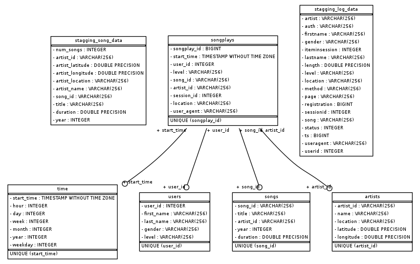

# Udacity Cloud Data Warehouse

In this project, we'll use the Python3 and AWS to create an end-to-end data pipeline, to

1. read JSON log files, stored in S3 (using the boto3 library)
2. create a Redshift cluster (using the boto3 library)
3. create a schema, named `sparkify` to store tables
4. build an ETL pipeline to create fact and dimension tables

## Overview
The goal of this project is to build an ETL for songs and user activity on a fictional music streaming app, for analytics purposes using AWS.

## Available Files
The project contains several files and folders, listed bellow  
.  
├── README.md  
├── create_tables.py  
├── creds.cfg  
├── delete_aws_instance.ipynb  
├── dwh.cfg  
├── etl.py  
├── set_up_redshift_cluster.ipynb  
└── sql_queries.py  

Script details can be found bellow,
- `create_tables.py` first step of the ETL, drop and create the tables. Run this file to reset the tables before each time the ETL scripts are run.
- `etl.py` file to read and process files stored in s3 and load them into the tables. 
- `sql_queries.py` contains all the sql queries, and is imported into both the files above.

Set-up and delete AWS Instances, 
- `set_up_redshift_cluster.ipynb` jupyter notebook that builds the Redshift cluster and creates the IAM role, which has access to s3.
- `delete_aws_instance.ipynb` jupyter notebook to delete the Redshift cluster and IAM role, created in the prior file.

Testing scripts (no need to run), 
- `test.ipynb` jupyter notebook that displays the first few rows of each table to let one check the database (sanity check).

## Available Data
There are two S3 buckets we are reading data from in this project, 
- `s3://udacity-dend/log-data` contains simulation based user event logs in JSON format.
- `s3://udacity-dend/song-data` contains a subset of the [Million Song Dataset](http://millionsongdataset.com/) in JSON format.

## Execution
1. Run the code in `set_up_redshift_cluster.ipynb` to create the Redshift Cluster

2. Use the command line to first create the schema and tables, by executing
```bash
$ python3 create_tables.py 
```
3. Run the following, to add data in the existing tables
```bash
$ python3 etl.py 
```
4. When you are done, don't forget to delete the clusters, to avoid AWS charges, by running the code in `delete_aws_instance.ipynb`

## Database Overview


### Staging Table(s)
```
sparkify.stagging_log_data
- description: raw log data 
- columns:
    - artist           VARCHAR
    - auth             VARCHAR
    - firstName        VARCHAR
    - gender           VARCHAR
    - itemInSession    INT
    - lastName         VARCHAR
    - length           FLOAT
    - level            VARCHAR
    - location         VARCHAR
    - method           VARCHAR
    - page             VARCHAR
    - registration     BIGINT
    - sessionId        INT
    - song             VARCHAR
    - status           INT
    - ts               BIGINT
    - userAgent        VARCHAR
    - userId           INT
```

```
sparkifydb.stagging_song_data
- description: raw song data
- columns:
    - num_songs         INT
    - artist_id         VARCHAR
    - artist_latitude   FLOAT
    - artist_longitude  FLOAT
    - artist_location   VARCHAR
    - artist_name       VARCHAR
    - song_id           VARCHAR
    - title             VARCHAR
    - duration          FLOAT
    - year              INT
```

### Fact Table(s)
```
sparkifydb.songplays
- description: records in log data associated with song plays (page:NextSong)
- columns:
    - songplay_id           SERIAL PRIMARY KEY
    - start_time            TIMESTAMP
    - user_id               INT
    - level                 VARCHAR
    - song_id               VARCHAR
    - artist_id             VARCHAR
    - session_id            INT
    - location              VARCHAR
    - user_agent            VARCHAR
- sortkey: start_time
- diststyle: user_id
```

### Dimension Table(s)
```
sparkifydb.users 
- description: users in the app
- columns:
    - user_id           INT PRIMARY KEY 
    - first_name        VARCHAR
    - last_name         VARCHAR
    - gender            VARCHAR
    - level             VARCHAR
- sortkey: user_id
- diststyle: all
```
```
sparkifydb.songs 
- description: songs in music database
- columns:
    - song_id           VARCHAR PRIMARY KEY
    - title             VARCHAR
    - artist_id         VARCHAR
    - year              INT
    - duration          FLOAT
- sortkey: song_id
- diststyle: all 
```
```
sparkifydb.artists 
- description: artists in music database
- columns:
    - artist_id: VARCHAR PRIMARY KEY
    - name: VARCHAR
    - location: VARCHAR
    - latitude: FLOAT
    - longitude: FLOAT
- sortkey: artist_id
- diststyle: all
```
```
sparkifydb.time 
- description: timestamps of records in songplays broken down into specific units
- columns:
    - start_time: TIMESTAMP PRIMARY KEY
    - hour: INT
    - day: INT
    - week: INT
    - month: INT
    - year: INT
    - weekday: INT
- sortkey: start_time
- diststyle: all
```